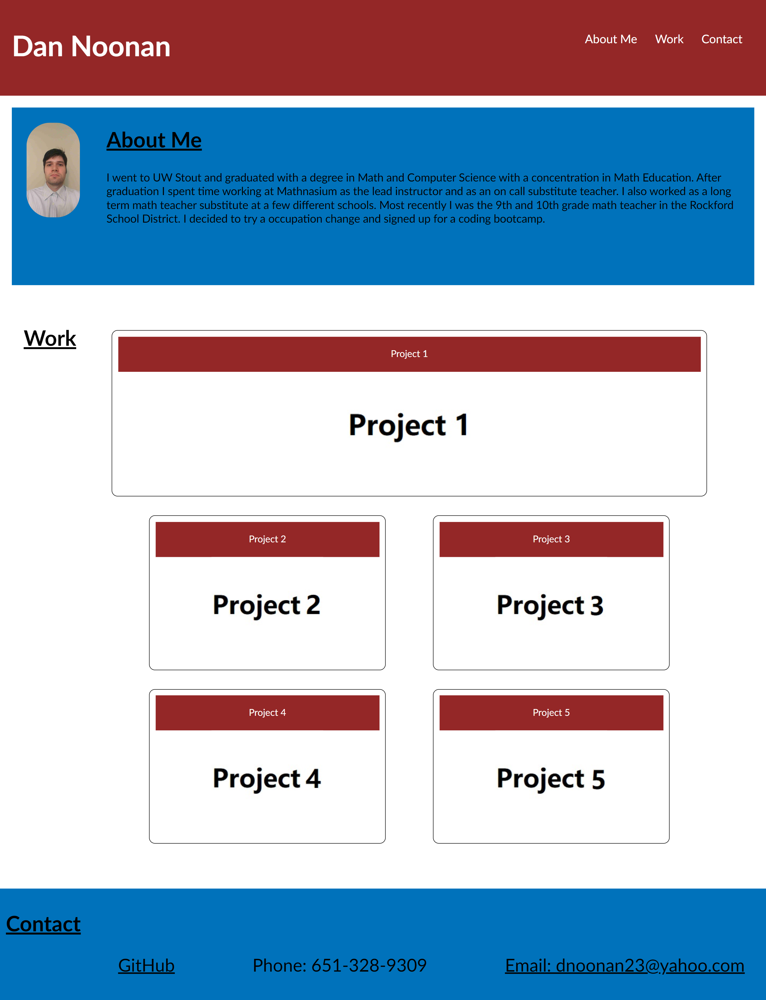

# <Profile HOMEWORK>

## Description

This project was to create a profile website to be able to show off the projects we do in this class by using html and css.  Most of the projects have not been done yet but I designed it in a way that I should be able to easily modify the website in order to add any new projects in the future.  The most difficult part for me was implamenting the flex box that I used on the project cards so that when the website is displayed on screens of different sizes they are still lined up properly.

## Installation

N/A

## Usage

To use the website open it in any browser.  The links at the top of the page cause the page to jump to that section.  The project cards can be clicked on to bring you to the deployed project.  Right now there is only one project deployed so only Project 1 has a link.  At the bottom of the page in the contact area you can click on github to be brought to my github profile and you can click on the e-mail link to open up you default e-mail to send an e-mail to me. 

## Credits

Some code modified from code taken from: 
https://git.bootcampcontent.com/

## License

N/A

## Features

This page feature flex box and embedded links.